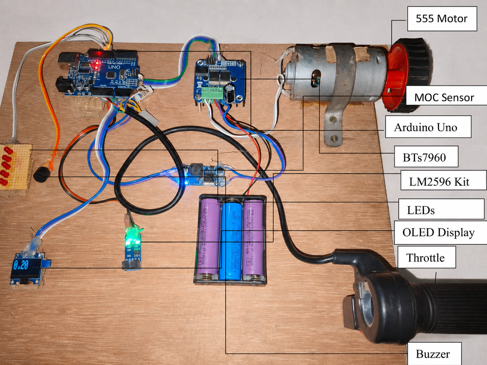
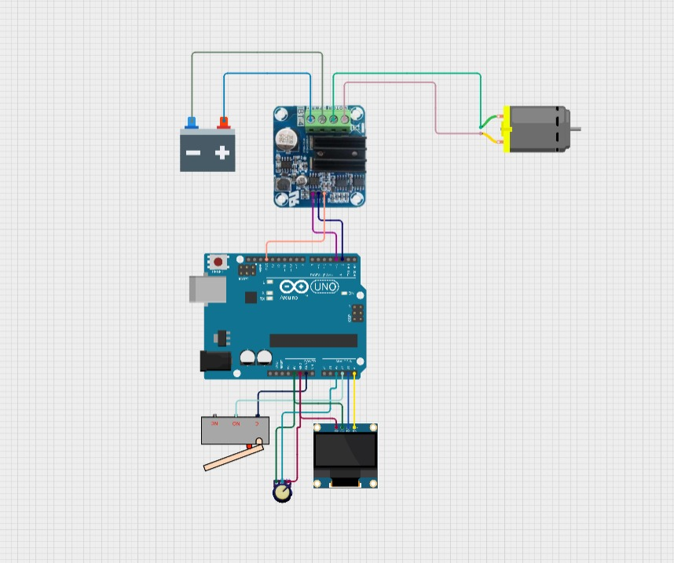

# E-Bike Speed Controller System

The E-Bike Speed Controller System is an Arduino-based embedded project designed to showcase efficient regulation of motor speed in electric mobility applications.

The project utilizes PWM (Pulse Width Modulation) method for controlling the speed of the motor based on the throttle signal along with real-time feedback by means of an OLED screen. The prototype comprises an Arduino Uno, BTS7960 motor controller, hall effect throttle sensor, MOC speed sensor, LM2596 voltage regulator, LEDs, buzzer, and battery management system.

As a member of a six-person team, serving as the Team Lead, I was in charge of hardware integration, circuit design, testing, troubleshooting, documentation, and presentation of the project.

This project helped me improve my knowledge of embedded systems, motor control, power electronics, and their application in electric vehicles.

## Prototype

## Circuit Diagram

## Repository Contents
- `Project_code/`
- `Abstract.pdf`
- `Report.pdf`
- `ebike_project.jpg`
- `Circuit_Diagram.jpeg`
